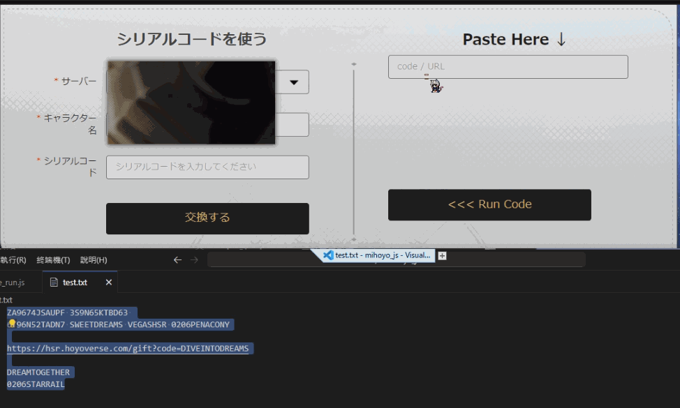

# 序列化序號輸入功能
中文 | [English](./README_en.md) | [日本語](./README_ja.md)

## 支援 hoyoverse 兩款遊戲
- 原神
- 鐵道

## 支援格式
- 單純的序號
- 兌換url（eg. `https://hsr.hoyoverse.com/gift?code=NB9TKRMK5R23`）

## 輸入方式
- 以上兩種可混合
- 以空隔、換行進行區隔
- 每組序號執行後將等待 5 秒，按鈕會顯示倒數

## 使用方法
1. 確定你有[Tampermonkey](https://www.tampermonkey.net/)
   如果你使用chrome也可以直接點[這裡](https://chromewebstore.google.com/detail/tampermonkey/dhdgffkkebhmkfjojejmpbldmpobfkfo)
2. [點此安裝腳本](https://greasyfork.org/zh-TW/scripts/486793-hoyoverse-%E5%BA%8F%E5%88%97%E5%8C%96%E5%BA%8F%E8%99%9F%E8%BC%B8%E5%85%A5)
3. 往後至官方網站兌換頁面即可
    [原神](https://genshin.hoyoverse.com/gift)
    [鐵道](https://hsr.hoyoverse.com/gift)

## 範例
```
ZA9674JSAUPF 3S9N65KTBD63 
6T96N52TADN7 SWEETDREAMS VEGASHSR 0206PENACONY

https://hsr.hoyoverse.com/gift?code=DIVEINTODREAMS

DREAMTOGETHER
0206STARRAIL
```
### 這幾個我用過了，顯示 fail


### 成功會顯示 OK
