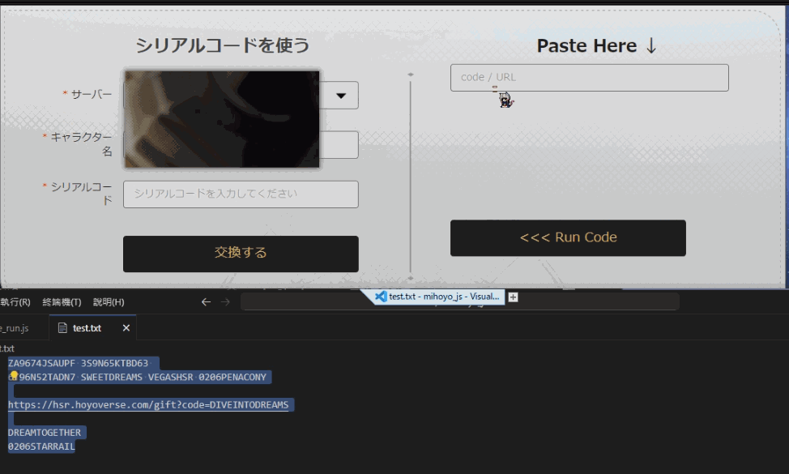
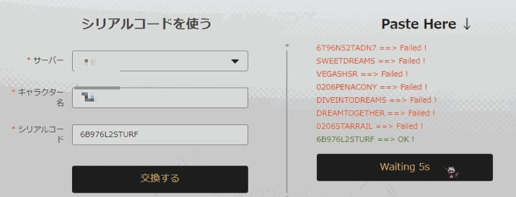

# Serial Number Input Plugin
[中文](/README.md) | English | [日本語](./README_ja.md)

## Supports two games in hoyoverse
- Genshin Impact
- HStar Rail

## Supported Formats
- Simple serial numbers
- URL (e.g., `https://hsr.hoyoverse.com/gift?code=NB9TKRMK5R23`)

## Input Method
- Both of the above can be mixed
- Separated by spaces or line breaks
- Due to cooldown, after runing each serial number, it will wait for 5 seconds for next. The button will display the countdown and run the next one.

## Usage
1. Make sure you have [Tampermonkey](https://www.tampermonkey.net/)
   If you are using Chrome, you can also click [here](https://chromewebstore.google.com/detail/tampermonkey/dhdgffkkebhmkfjojejmpbldmpobfkfo)
2. [Install the script](https://greasyfork.org/en/scripts/486793-hoyoverse-%E5%BA%8F%E5%88%97%E5%8C%96%E5%BA%8F%E8%99%9F%E8%BC%B8%E5%85%A5)
3. After that, you can go to the official exchange page
    [Genshin Impact](https://genshin.hoyoverse.com/gift)
    [HStar Rail](https://hsr.hoyoverse.com/gift)

## Example
```
ZA9674JSAUPF 3S9N65KTBD63 
6T96N52TADN7 SWEETDREAMS VEGASHSR 0206PENACONY

https://hsr.hoyoverse.com/gift?code=DIVEINTODREAMS

DREAMTOGETHER
0206STARRAIL
```

### The following codes I have used, and it shows fail


### If successful, it will display OK

