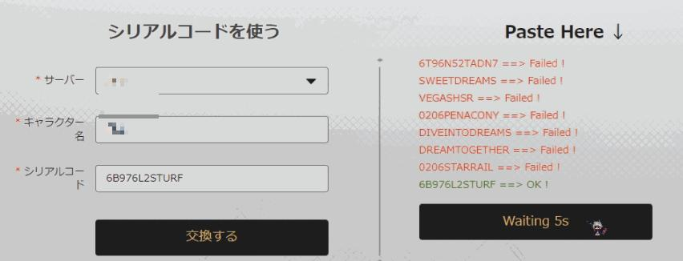

# シリアル序列化入力機能
[中文](/README.md) | [English](./README_en.md) | 日本語

## hoyoverse 2つのゲーム
- 原神
- 崩壊スターレイル

## サポートされている形式
- 単純なシリアル番号
- 交換URL（例：`https://hsr.hoyoverse.com/gift?code=NB9TKRMK5R23`）

## 入力方法
- 上記の混合使用はOK
- スペースや改行で切る
- 各シリアルは 5 秒待機しまし。カウントダウンはボタンで表示します。

## 使用方法
1. [Tampermonkey](https://www.tampermonkey.net/)をインストールしてください
   Chromeを使っているなら、[ここをクリック](https://chromewebstore.google.com/detail/tampermonkey/dhdgffkkebhmkfjojejmpbldmpobfkfo)
2. [スクリプトをインストール](https://greasyfork.org/zh-TW/scripts/486793-hoyoverse-%E5%BA%8F%E5%88%97%E5%8C%96%E5%BA%8F%E8%99%9F%E8%BC%B8%E5%85%A5)
3. 以後、公式サイトの交換ページに行けばOK
    [原神](https://genshin.hoyoverse.com/gift)
    [崩壊スターレイル](https://hsr.hoyoverse.com/gift)

## 例
```
ZA9674JSAUPF 3S9N65KTBD63 
6T96N52TADN7 SWEETDREAMS VEGASHSR 0206PENACONY

https://hsr.hoyoverse.com/gift?code=DIVEINTODREAMS

DREAMTOGETHER
0206STARRAIL
```

### 使ったコードので、fail を表示


### 成功の場合は、OKを表示
